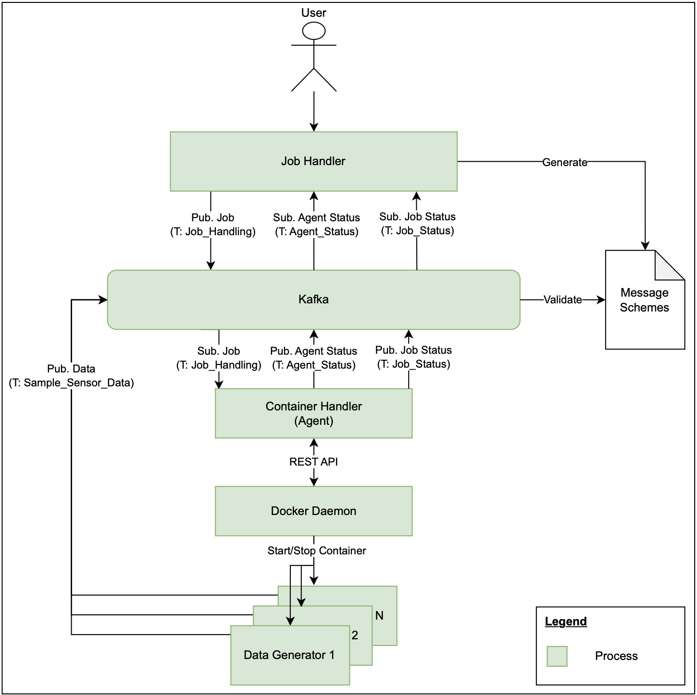
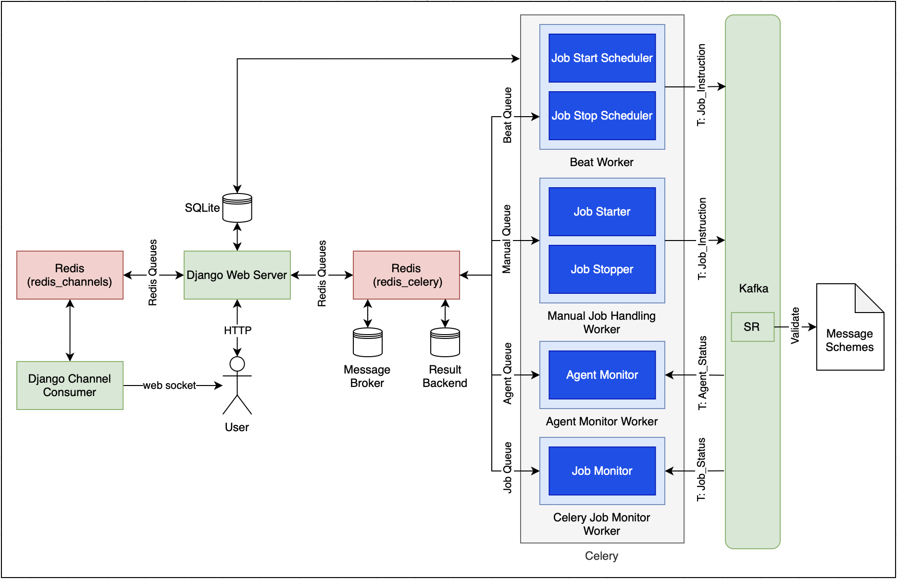
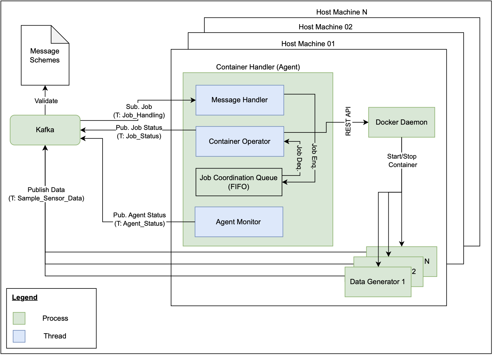

# Distributed Computation Framework


## Table of Contents
1. [Project Description and Provided Features](#1-project-description-and-provided-features)
2. [Framework Architecture](#2-framework-architecture)
3. [Getting Started](#3-getting-started)
4. [Usage](#4-usage)  
5. [Limitations & Outlook](#5-limitations--outlook)
6. [Licensing](#6-licensing)
7. [Contacts](#7-contacts)  

## 1) Project Description and Provided Features
The goal of this project is to provide a distributed computation framework (DCF) based on Kafka and Docker, which is designed to manage the lifecycle of Docker containers that generate sample data and deliver it via distinct Kafka topics.

Using a graphical user interface (GUI), users can easily submit jobs by providing a small set of parameters, such as the Docker container image name and the Kafka topic to which the generated data will be delivered. This simple interface is designed to be user-friendly, minimising the overhead for users to get started with data generation tasks. The complexity is abstracted and the user does not have to worry about the underlying infrastructure.

Once a job is submitted, the framework orchestrates the necessary processes to ensure that the user's requirements are met efficiently. The framework is designed to scale, allowing it to handle multiple concurrent jobs, each with unique parameters.


## 2) Framework Architecture
### 2.1) Architecture & Components
The proposed framework consists of six main components, which are described briefly subsequently:

1) **Kafka**: Distributed event streaming platform used to a) coordinate actions performed by the Job Handler and Container Handler (Agent), to b) provide agent monitoring mechanisms, and c) provide an event streaming endpoint for the Data Generator(s). While the topics for a) and b) are predefined and use schema validation, the topic(s) for c) can be defined individually for each submitted job and schema validation is not performed.<br>
The DCF uses Apache Kafka Raft (KRaft) as the consensus protocol, allowing the removal of Apache ZooKeper and its dependencies. The result is a simplified architecture, as the responsibility for metadata management can be consolidated into Kafka itself.<br>
To allow the framework to orchestrate the necessary processes, the three management topics 1) Job_Handling (creation & deletion of jobs), 2) Job_Status (status information of the jobs submitted) and 3) Agent_Status (status information of the Container Handler) are used. With a replication factor of 1 and only 1 partition, they all share the same configuration. More about the limitation of this configuration can be found in [Section 5](#5-limitations--outlook) (limitation 02).
2) **Kafka Schema Registry**: Centralized repository for the management and validation of schemes for message data that supports serialization and deserialization. The schema registry takes on a key role in ensuring data consistency and compatibility, especially as schemes evolve.<br>
The DCF uses Apache Avro as the serialization format. The three different Avro schemes 1) [Job Handling](./schemes/job_handling.avsc), 2) [Job Status](./schemes/job_status.avsc) and 3) [Agent Status](./schemes/agent_status.avsc) were defined and are in line with the topics described above.
3) **Docker Daemon**: Service responsible for orchestrating container lifecycle management. It handles tasks such as container creation, execution, deletion and monitoring required to fulfil the jobs submitted.
4) **Job Handler**: Service, which is responsible for managing and orchestrating jobs. The system consists of a web server, Celery workers, Kafka, and a persistence layer to ensure efficient orchestration. The Job Handler provides a user-friendly GUI for creating, monitoring, and managing jobs, providing real-time updates using Django Channels and web sockets.
As the Job Handler plays a crucial role within the framework, it will be described in more detail in [Section 2.2](#22-job-handler).
5) **Container Handler (Agent)**: Agent, which is responsible for starting/stopping containers and providing monitoring capabilities for processing jobs submitted via the GUI. As the Container Handler plays a crucial role within the framework, it will be described in more detail in [Section 2.3](#23-container-handler-agent).
6) **Data Generator(s)**: Docker containers that generate and expose sample data to a chosen/defined Kafka topic. As the logic for generating data is out of scope, the focus is on configuring the data generator containers to fit into the DCF. To do so, [Section 3.5](#35-preparing-the-data-generators) can be consulted.

The graphical representation of the DCF architecture and the interactions between the six different components can be found in the Figure 01 below:

*Figure 01: Architecture Overview*

### 2.2) Job Handler
The Job Handler is responsible for the management of the lifecycle of jobs, including their creation, monitoring, and termination at a high level. To ensure an efficient orchestration, the application interacts with various other components, such as the web server, Celery workers, Kafka, and the database. The Job Handler provides the following three main features:
1. **User-friendly GUI**: This interface provides a comprehensive management solution, which we refer to as job orchestration, for the lifecycle of jobs, encompassing their creation, monitoring and termination at a high level. Users can effortlessly create new jobs, monitor the status of running jobs/available agents in real-time by using Django Channels/web sockets, and manage job lifecycles within the GUI.
2. **Job scheduling**: The Job Handler facilitates efficient job scheduling, enabling users to schedule jobs to run for designated durations and at predetermined times. Users can track the elapsed time for jobs in seconds and monitor job progress by observing the job status.
3. **Scalability**: The Job Handler is designed to be scalable, allowing it to handle multiple concurrent jobs and multiple users. It can distribute tasks across multiple Celery workers and manage job orchestration efficiently.

In order to achieve the features mentioned, ensuring reliability and maintainability, the architecture comprises the following key components:
- **Celery**: Responsible for the management of tasks and concurrency. This includes asynchronous tasks such as starting and stopping jobs, periodic tasks like monitoring job run lifecycles, and permanent tasks like observing agents and jobs.
- **Django**: Serves as the web framework, handling HTTP requests, rendering templates, and managing the database.
- **Django Channels**: Enable real-time communication using web sockets, providing live updates to the user interface.
- **Redis**: Used as the backend for Django Channels and Celery, providing fast in-memory storage.
- **SQlite**: The primary database for storing job, agent and container information (including further data models). More about the limitation of this setup can be found in [Section 5](#5-limitations--outlook) (limitation 05).

The graphical representation of the Job Handler architecture and the interactions necessary can be found in the Figure 02 below:

*Figure 02: Architecture Overview Job Handler*

- **Django Web Server**: Offers a user-friendly experience for managing and deploying jobs. It handles HTTP requests, renders templates and manages the database. In addition to orchestrating job forwarding to Celery Workers, the web server is responsible for CRUD operations and first-level validation. Furthermore, the web server serves as the central configuration unit for Channels and Celery.
- **Django Channel Consumer**: Responsible for implementing a consumer group and web socket for the frontend. The backend components, web server and Celery Workers communicate with the Channel Consumer to update the user in the frontend. The backend components reach the clients via the consumer group.
- **Celery Workers**: Host independent processes (tasks) handling the job orchestration. All tasks are connected to Kafka to communicate with the Container Handler by consuming and producing messages. The tasks are connected to specific Kafka topics. All tasks are running in parallel and are distributed over multiple Celery Workers. The Celery Workers are running in a distributed environment and are connected to the Redis message broker. All tasks are handling business logic independently and are manipulating the main database (SQlite). The six celery workers available are introduced subsequently:
    - **Agent Monitor**: Plays a vital role in the system's operations. It is responsible for monitoring agents that have registered with the Job Handler via Kafka. The Agent Monitor consumes messages from the Kafka topic Agent_Status and is responsible for managing agents.
    - **Job Monitor**: Tasked with monitoring and managing the running jobs on Container Handler(s). It consumes messages from the Kafka topic Job_Status.
    - **Job Starter**: Asynchronous task that is triggered by the web server when a user requests the initiation of a job. If the conditions for starting the job are met, the task requests that the Container Handler start the relevant containers. The Job Starter produces messages to the Kafka topic Job_Instruction.
    - **Job Start Scheduler**: Responsible for monitoring the job-start conditions (DateTime in UCT format). If the conditions are fulfilled, the Container Handler is requested to initiate the jobs. The Job Start Scheduler produces messages to the Kafka topic Job_Instruction.
    - **Job Stopper**: Asynchronous task triggered by the web server when a user requests that a job be stopped. If the conditions for stopping the job are fulfilled, the task requests that the Container Handler stop and delete the corresponding containers. The Job Stopper produces messages to the Kafka topic Job_Instruction.
    - **Job Stop Scheduler**: Responsible to monitor running jobs. In the event that the jobs have reached their maximum computation time, the Container Handler will be requested to stop the jobs. The Job Stop Scheduler produces messages to the Kafka topic Job_Instruction.

The job handling, besides basic CRUD (no update), is handled fully asynchronously and concurrently with Celery.The business logic (tasks) is distributed over multiple Celery Workers, which operate independently and concurrently.Empirical testing showed that operating all tasks on a single Celery Worker resulted in communication and performance bottlenecks.Therefore, the tasks are distributed over multiple Celery Workers and Redis message queues. The Beat Worker is responsible for Celery Beat tasks, while the Manual Job Handling Worker executes asynchronous tasks manually triggered by users.As the Celery Worker workload for manual tasks is not permanent, these tasks are combined in one Celery Worker.The Agent Monitor and Job Monitor operate in separate Celery Workers since they run permanently. 

### 2.3) Container Handler (Agent)
In order for the Container Handler to be able to start/stop containers and provide monitoring capabilities, several components are required - of particular interest is the Container Handler (Agent) process, which represents a multithreded environment, consisting of the following two threads:
- **Agent Monitor**: Responsible for monitoring the health of the Docker Daemon and reporting on the containers under the responsibility of the specific agent. The Agent Monitor provides the monitoring result to the Job Handler via the Kafka topic Agent_Status at a predefined interval. If access to the Docker Daemon fails, not only is an unsuccessful monitoring result sent, but the container handler (thread) is also blocked, meaning that no further messages are consumed.
- **Container Handler**: Responsible for starting/stopping containers by consuming messages from the Job_Instruction Kafka topic and communicating with the Docker Daemon. After each and every job is processed, a status message targeting the specific processed job is created in the Job_Status Kafka topic. Sophisticated exception handling ensures that the Container Handler runs as reliably as possible.

The graphical representation of the Container Handler (Agent) architecture and the interactions necessary can be found in the Figure 03 below:

*Figure 03: Architecture Overview Container Handler (Agent)*

### 2.4) Technologies used

To implement the DCF, the following technology stack is used:


## 3) Getting Started
All commands outlined in this chapter must be run from the root directory of this project, otherwise adapt them accordingly.

### 3.1) Prerequisites
Ensure that the following requirements are met:
- Installed [Python v3.13](https://www.python.org/downloads/release/python-3130)
- Up and running [Docker Daemon](https://docs.docker.com/engine/install) on all host machines on which the Container Handler (Agent) is to run
- (Optional, but highly recommended) A Python virtual environment (venv). To do so, proceed as follows:
    1. Create the Python virtual environment named venv:
        ```bash
        python3.13 -m venv venv
        ```
    2. Activate the virtual environment in every terminal used and make sure it has been activated correctly:
        ```bash
        source venv/bin/activate
        which python3.13 && which pip3.13
        # Ensure, the following ouput is returned to check for correct activation:
        # ./venv/bin/python3.13
        # ./venv/bin/pip3.13
        ```
- Required Python dependencies:
    1. Install the required dependencies:
        ```bash
        python3.13 -m pip install -r requirements.txt
        ```
- It should be noted that the available [.env File](./.env) provides fundamental configuration options. Despite the possibility that this may not align with best practice, it was deemed an appropriate course of action in order to facilitate more efficient handling of the DCF

### 3.2) Kafka
With the provided [Docker Compose File](./kafka/docker-compose.yaml), the installation of Kafka is straightforward. As additional configuration is performed automatically during startup (see [initialize.py](./kafka/initialize.py) and initializer container within Docker Compose File), only the subsequent steps must be completed:
1. Open a new terminal or reuse the one from [Section 3.1](#31-prerequisites) (make sure the venv is activated properly, use `source venv/bin/activate` otherwise)
2. Start Kafka, the GUI, the Schema registry and the initialization by running the following command:
   ```bash
    docker compose -f kafka/docker-compose.yaml up -d
    # be aware: Kafka might take a few seconds to be deployed

    # if it should be necessary to stop the cluster, use docker compose -f kafka/docker-compose.yaml down
    ```
2. (Optional, but highly recommended) After the startup of Kafka, you can access:<br>
    3.1 Kafka Grapical User Interface: http://localhost:8080<br>
    3.2 Kafka Schema registry: http://localhost:8081

### 3.3) Container Handler (Agent)
To start up an instance of the Container Handler (Agent), proceed as follows:
1. Open a new terminal or reuse the one from [Section 3.2](#32-kafka) (make sure the venv is activated properly, use `source venv/bin/activate` otherwise)
2. Start the Container Handler (Agent) by performing the subsequent command :
    ```bash
    python3.13 -m orchestrator.container_handler.container_handler
    ```
3. (Optional, but highly recommended) Refer to the [log file](./logs/app.log) to ensure that the system has booted up correctly

### 3.4) Job Handler
Each command should run in its own terminal window or session to ensure all processes operate concurrently.
For efficiency during development, tools like tmux or screen to manage multiple terminal sessions in one window can be used. 

To set up and run the Job Handler follow the steps subsequently:
1. Open a new terminal (make sure the venv is activated properly, use `source venv/bin/activate` otherwise)
2. Start Redis with the provided [Docker Compose File](./orchestrator/control_server/docker-compose.yaml) by running the following command:
    ```bash
    docker-compose -f orchestrator/control_server/docker-compose.yaml up -d
    # be aware: Redis might take a few seconds to be deployed
    ```
    This command will spin up the following two Redis instances:
    - redis_channels: enabling asynchronous parallelized web sockets and consumer groups with Django Channels
    - redis_celery: serving celery workers. The Broker  and the Result Backend use two seperate Databases
3. Apply Django migrations (create database schema) by running:
    ```bash
    python3.13 orchestrator/control_server/manage.py migrate
    ```
4. Start the Django server with the subsequent command: 
    ```bash
    python3.13 orchestrator/control_server/manage.py runserver
    ```
    If successful, the server is accessible under http://127.0.0.1:8000/job_handler or localhost:8000/job_handler


(Optional, but highly recommended) After the startup of Kafka, you can access:
3.1 Kafka Grapical User Interface: http://localhost:8080
3.2 Kafka Schema registry: http://localhost:8081


5. Run the following commands to start the Celery Workers. Open a new terminal for every command, four in total (make sure the venv is activated properly, use `source venv/bin/activate` otherwise):
    - Worker for manual job handling:
        ```bash
        cd orchestrator/control_server/ && celery -A control_server_project worker --queues manual_job_handling --loglevel=info
        ```
    - Worker for Celery Beat tasks
        ```bash
        cd orchestrator/control_server/ && celery -A control_server_project worker --queues beat --loglevel=info
        ```
    - Worker for monitoring agent status
        ```bash
        cd orchestrator/control_server/ && celery -A control_server_project worker --queues monitor_agent_status --loglevel=info
        ```
    - Worker for monitoring job status
        ```bash
        cd orchestrator/control_server/ && celery -A control_server_project worker --queues monitor_job_status --loglevel=info
        ```
6. Start the Celery Beat Scheduler by running in a new terminal (make sure the venv is activated properly, use `source venv/bin/activate` otherwise):
    ```bash
    cd orchestrator/control_server/ && celery -A control_server_project beat --loglevel=info --scheduler django_celery_beat.schedulers:DatabaseScheduler
    ```
Once all the services are running, the application can be accessed under http://127.0.0.1:8000/job_handler or localhost:8000/job_handler


(Optional, but highly recommended) After the startup of Kafka, you can access:
3.1 Kafka Grapical User Interface: http://localhost:8080
3.2 Kafka Schema registry: http://localhost:8081

### 3.5) Preparing the Data Generator(s)
In order to integrate the Data Generator(s) into the DCF, some minor adjustments (within the relevant parts of the application source code) are required, as shown below:
1. Install the required dependency ([confluent-kafka](https://docs.confluent.io/platform/current/clients/confluent-kafka-python/html/index.html#)) by means of the following command:
    ```bash
    python3.13 -m pip install confluent-kafka
    ```
2. Use the following code snippet to import the Producer class and the os package:
    ```python 
    from confluent_kafka import Producer
    import os
    ```
3. Initialise the [Kafka Producer](https://docs.confluent.io/platform/current/clients/confluent-kafka-python/html/index.html#pythonclient-producer
) with the following snippet of code:
    ```python 
    # load environment variables necessary for Kafka accessability
    kafka_bootstrap_servers_docker = os.getenv("KAFKA_BOOTSTRAP_SERVERS_DOCKER")
    kafka_topic = os.getenv("KAFKA_TOPIC")
    # initialize Kafka Producer if environment variables loaded successfully
    if kafka_bootstrap_servers and kafka_topic:
        kafka_producer = Producer({"bootstrap.servers": kafka_bootstrap_servers_docker})
    ```
4. At the correct position (ideally within a while true-loop with the appropriate interval), stream the data to the Kafka topic previously defined in the GUI by integrating the following bit of code:
    ```python 
    kafka_producer.produce(topic=kafka_topic, value=json.dumps(output_data).encode('utf-8'))
    ```
    Note: Make sure that output_data is a serialisable Python object (e.g. dict, list)

Once the integration described in the four steps above has been completed, please proceed as usual. This involves building the container and making it accessible via Docker Hub. Now the container image is ready to be used. 

Please note that, in addition to confluent-kafka, other libraries can be utilised. If you do not wish to work with Python, you may use Java instead. In both cases, adjust the source code accordingly.

## 4) Usage
### 4.1) Subtitle 1
@Lendro & @Christian, as soon as Graphical User Interface is ready

### 4.2) Subtitle 2
@Lendro & @Christian, as soon as Graphical User Interface is ready


## 5) Limitations & Outlook
Although the DCF is already quite powerful, it does have limitations, which will be presented below. For each limitation, a possible solution is given:

- **Limitation 01**: At this stage, the project is only considered to run on a single host setup, meaning that all six components introduced in [Section 2.1](#21-architecture--components) run on the same host machine. While this setup may be appropriate in the context of the current project, and well suited for Kafka, the Kafka Schema Registry, and the Job Handler, for deployment in a production environment, it is not appropriate for the Container Handler (Agent) and the Data Generator(s).
- **Outlook 01**: For the DCF to be "truly" distributed, it is necessary to containerise the Container Handler (Agent) and make it available via a container registry. Containerisation makes it easy to run the Container Handler (Agent) on multiple host machines, so that submitted jobs can be distributed across multiple host machines. The small amount of configuration required can be easily provided via environment variables that are passed to th
<br><br>

- **Limitation 02**: As outlined in [Section 2.1](#21-architecture--components), the three management topics Job_Handling, Job_Status and Agent_Status each have one partition and a replication factor of one. While the replication factor enhances durability, availability and is not the main focus of the limitation (and not considered subsequently), it is the partitioning that presents a challenge. The reason is straightforward: When working with a single partition, only one consumer from a consumer group can consume messages from that specific partition. What does this mean? While, this is not an issue for the Job_Status and Agent_Status topics, as they are only consumed by the Job Handler (one consumer), the Job_Handling topic is problematic because, when scaling the Container Handler (Agent), it does not have any effect, as only one Container Handler (Agent) is able to processes submitted jobs.
- **Outlook 02**: The following changes are required to overcome the limitation:
    - The Kafka topic Job_Handling must be split into two, for example Job_Creation and Job_Deletion:
        - The Kafka topic Job_Creation must have as many partitions as Container Handlers (Agents). This ensures that jobs (by default) are distributed in a round robin manner on the different Container Handlers (Agents). While adding partitions at runtime is possible, deleting them is not. However, if the number of partitions exceeds the number of Container Handlers (Agents), one Container Handler (Agent) will consume messages from multiple partitions, ensuring that all messages from the Kafka topic Job_Creation are handled accordingly.
        - The Kafka topic Job_Deletion requires only one partition, but further configuration is necessary when it comes to the group_id (see below).
    - It is necessary to adjust the Container Handler (thread within the Container Handler (Agent)). Rather than working with only one thread, it is necessary to introduce another thread. These threads will be referred to as Create Thread and Delete Thread (which replace the Container Handler thread):
        - Create Thread: The purpose of this thread is to consume messages from the Kafka topic Job_Creation. It is imperative that all of these consumers (on the different Container Handlers (Agents)) reside in the same group ID, to ensure that creation jobs are only handled once. Obviously, the thread must be able to create Data Generators
        - Delete Thread: The purpose of this thread is to consume messages from the Kafka topic Job_Deletion. All of these consumers (on the different Container Handlers (Agents)) must reside in a different group ID, to ensure each and every Container Handler (Agent) is able to check deletion message and verify the relevance of the respective message to the agent (implemented via an Agent-ID). Obviously, the thread must be able to delete Data Generators.
    
    With such a configuration, it is guaranteed that tasks are allocated to various Container Handlers (Agents) in a round-robin manner (by default), with each Container Handler (Agent) capable of reading deletion messages and determining the relevance of a specific message and whether action is necessary. 
<br><br>

- **Limitation 03**: As of now, images of Data Generators can only be fetched from DockerHub.
- **Outlook 03**: In order to facilitate access to multiple container registries, it is necessary to adjust the [Job Handling Avro Schema](./schemes/job_handling.avsc). This process involves the addition of information regarding the container registry, as well as any relevant authentication details if applicable. This information is then utilised by the Container Handler (Agent) to retrieve images from a range of container registries and start the corresponding containers.
<br><br>

- **Limitation 04**: At present, the Container Handler (Agent) is subject to only one active check: the Docker Daemon Checker.
- **Outlook 04**: In order to enhance the reliability of the Container Handler (Agent), it is possible to incorporate supplementary checks, such as those pertaining to resource availability. These checks can be simply be integrated into the Container Handler (Agent) (), (see observe_agent() and checker() within the [source code](./orchestrator/container_handler/container_handler.py)), with all other processes being managed automatically.
<br><br>
- **Limitation 05**: The Job Handler currently uses a SQlite database. While this is sufficient for development purposes, it is not recommended for production environments.

- **Outlook 05**: Future work should focus on migrating the database to a more robust solution, such as PostgreSQL. This can be achieved by adjusting the Django settings file accordingly and deploying a PostgreSQL instance.

## 6) Licensing
The DCF is available under the MIT [license](./LICENSE).

## 7) Contacts
- **Christian Bieri**, Site Reliability Engineer, info@christianbieri.ch
- **Frederico Fischer**, DevOps Engineer, fredae14@hotmail.com
- **Leandro Hoenen**, DevOps Engineer, exponent_stooge805@perfunc.ch