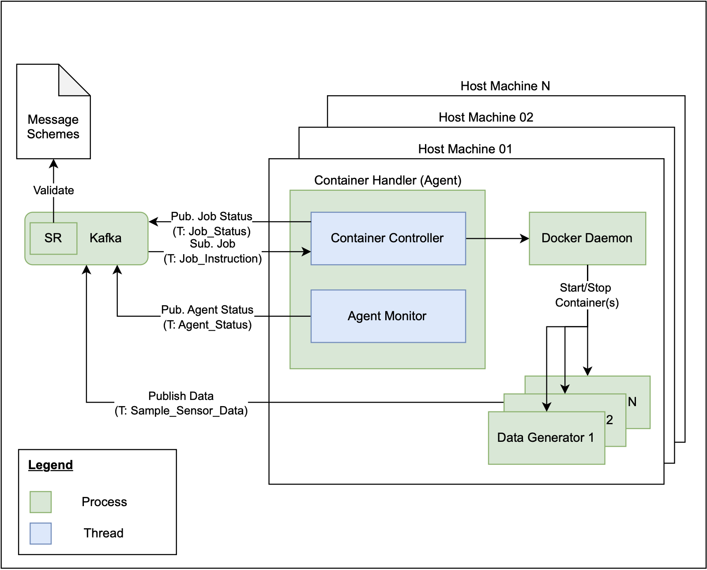

# Distributed Computation Framework


## Table of Contents
1. [Project Description and Provided Features](#1-project-description-and-provided-features)
2. [Framework Architecture](#2-framework-architecture)
3. [Getting Started](#3-getting-started)
4. [Usage](#4-usage)  
5. [Limitations & Outlook](#5-limitations--outlook)
6. [Licensing](#6-licensing)
7. [Contacts](#7-contacts)  

## 1) Project Description and Provided Features
The goal of this project is to provide a distributed computation framework (DCF) based on Kafka and Docker, which is designed to manage the lifecycle of Docker containers that generate sample data and deliver it via distinct Kafka topics.

Using a graphical user interface (GUI), users can easily submit jobs by providing a small set of parameters, such as the Docker container image name and the Kafka topic to which the generated data will be delivered. This simple interface is designed to be user-friendly, minimising the overhead for users to get started with data generation tasks. The complexity is abstracted and the user does not have to worry about the underlying infrastructure.

Once a job is submitted, the framework orchestrates the necessary processes to ensure that the user's requirements are met efficiently. The framework is designed to scale, allowing it to handle multiple concurrent jobs, each with unique parameters.

## 2) Framework Architecture
### 2.1) Architecture & Components
The proposed framework consists of six main components, which are described briefly subsequently:

1) **Kafka**: Distributed event streaming platform used to a) coordinate actions performed by the Job Handler and Container Handler (Agent), to b) provide agent monitoring mechanisms, and c) provide an event streaming endpoint for the data generator(s). While the topics for a) and b) are predefined and use schema validation, the topic(s) for c) can be defined individually for each submitted job and schema validation is not performed.<br>
The DCF uses Apache Kafka Raft (KRaft) as a consensus protocol, allowing the removal of Apache ZooKeper and its dependencies. The result is a simplified architecture, as the responsibility for metadata management can be consolidated into Kafka itself.<br>
To allow the framework to orchestrate the necessary processes, the three management topics 1) Job_Handling (creation & deletion of jobs), 2) Job_Status (status information of the jobs submitted) and 3) Agent_Status (status information of the Container Handler (Agent)) are used. With a replication factor of 1 and only 1 partition, they all share the same configuration. More about the limitations of this configuration can be found in [Section 5](#5-limitations--outlook).
2) **Kafka Schema Registry**: Repository (centralized) for management and validation of schemes for message data that supports serialization and deserialization. The schema registry takes on a key role en ensuring data consistency and compatibility, especially as schemes evolve.<br>
The DCF uses Apache Avro as the serialization format. The three different Avro schemes 1) [Job Handling](./schemes/job_handling.avsc), 2) [Job Status](./schemes/job_status.avsc) and 3) [Agent Status](./schemes/agent_status.avsc) are defined and go hand in hand with the topics described above.
3) **Docker Daemon**: Service responsible for orchestrating container lifecycle management. It handles tasks such as container creation, execution, deletion and monitoring required to fulfil the jobs submitted.
4) **Job Handler**: @Leandro, GUI + Business Logic
As the Job Handler (Agent) plays a crucial role within the framework, it will be described in more detail in [Section 2.2](#22-job-handler).
5) **Container Handler (Agent)**: Agent, which is responsible for starting/stopping containers and providing a monitoring capabilities for processing jobs submitted via the GUI. As the Container Handler (Agent) plays a crucial role within the framework, it will be described in more detail in [Section 2.3](#23-container-handler-agent).
6) **Data Generator(s)**: Docker containers that generate and expose sample data to a chosen/defined Kafka topic. As the logic for generating data is out of scope, the focus is on configuring the data generator containers to fit into the DCF. For this, [Section 3.5](#35-preparation-of-docker-containers) can be consulted.

The graphical representation of the DCF architecture and the interactions between the six different components can be found in the Figure 01 below:

*Figure 01: Architecture Overview*

### 2.2) Job Handler
@Leandro

The graphical representation of the Job Handler architecture and the interactions necessary can be found in the Figure 02 below:

*Figure 02: Architecture Overview Job Handler*

### 2.3) Container Handler (Agent)
In order for the Container Handler (Agent) to be able to start/stop containers and provide monitoring capabilities, several components are required - of particular interest is the Container Handler (Agent) process, which represents a multithreded environment, consisting of the following two threads:
- **Agent Monitor**: Responsible for monitoring the health of the Docker Daemon and reporting on the containers under the responsibility of the specific agent. The Agent Monitor provides the monitoring result to the Job Handler via the Kafka topic Agent_Status at a predefined interval. If access to the Docker Daemon fails, not only is an unsuccessful monitoring result sent, but the container handler (thread) is also blocked, meaning that no further messages are consumed.
- **Container Handler**: Responsible for starting/stopping containers by consuming messages from the Job_Instruction Kafka topic and communicating with the Docker Daemon. After each and every job is processed, a status message targeting the specific processed job is created in the Job_Status Kafka topic. Sophisticated exception handling ensures that the Container Handler runs as reliably as possible.

The graphical representation of the Container Handler (Agent) architecture and the interactions necessary can be found in the Figure 03 below:

*Figure 03: Architecture Overview Container Handler (Agent)*

### 2.4) Technologies used

To implement the DCF, the following technology stack is used:


## 3) Getting Started
All commands outlined in this chapter must be run from the root directory of this project, otherwise adapt them accordingly.

### 3.1) Prerequisites
Ensure that the following requirements are met:
- Installed [Python v3.13](https://www.python.org/downloads/release/python-3130)
- Up and running [Docker Daemon](https://docs.docker.com/engine/install) on all host machines on which the Container Handler (Agent) is to run
- (Optional, but highly recommended) A Python virtual environment (venv). To do so, proceed as follows:
    1. Create the Python virtual environment named venv:
        ```bash
        python3.13 -m venv venv
        ```
    2. Activate the virtual environment and make sure it has been activated correctly :
        ```bash
        source venv/bin/activate
        which python3.13 && which pip3.13
        # Ensure, the following ouput is returned to check for correct activation:
        # ./venv/bin/python3.13
        # ./venv/bin/pip3.13
        ```
- Required Python dependencies:
    1. Install the required dependencies:
        ```bash
        python3.13 -m pip install -r requirements.txt
        ```
### 3.2) Kafka
With the provided [Docker Compose File](./kafka/docker-compose.yaml), the installation of Kafka is straightforward. As additional configuration is performed automatically during startup (see [initialize.py](./kafka/initialize.py) and initializer container within Docker Compose File), only the subsequent steps must be completed:
1. Start Kafka, the GUI, the Schema registry and the initialization by running the following command:
   ```bash
    docker compose -f kafka/docker-compose.yaml up -d
    # be aware: Kafka might take a few seconds to be deployed

    # if it should be necessary to stop the cluster, use docker compose -f kafka/docker-compose.yaml down
    ```
2. Set the following environment variable and (optional) check if they were set correctly by running the following command:
    ```bash
    export KAFKA_BOOTSTRAP_SERVERS_HOST=localhost:9092 && export SCHEMA_REGISTRY_URL=http://localhost:8081

    # by running
    ENV | grep -e "KAFKA_BOOTSTRAP_SERVER" -e "SCHEMA_REGISTRY_URL"
    # Ensure, the following output is returned:
    # KAFKA_BOOTSTRAP_SERVERS_HOST=localhost:9092
    # SCHEMA_REGISTRY_URL=http://localhost:8081
    ```
3. (Optional, but highly recommended) After the startup of Kafka, you can access:<br>
    4.1 Kafka Grapical User Interface: http://localhost:8080<br>
    4.2 Kafka Schema registry: http://localhost:8081


### 3.3) Job Handler
@Leandro

### 3.4) Container Handler (Agent)
To start up an instance of the Container Handler (Agent), proceed as follows:
1. Start the Container Handler (Agent) by performing the subsequent command and (optional) check the
[log file](./logs/app.log):
    ```bash
    python3.13 -m orchestrator.container_handler.container_handler
    ```
### 3.5) Preparing the Data Generator(s)
In order to integrate the Data Generator(s) into the DCF, some minor adjustments (within the relevant parts of the application source code) are required, as shown below:
1. Install the required dependency ([confluent-kafka](https://docs.confluent.io/platform/current/clients/confluent-kafka-python/html/index.html#)) by means of the following command:
    ```bash
    python3.13 -m pip install confluent-kafka
    ```
2. Use the following code snippet to import the Producer class and the os package:
    ```python 
    from confluent_kafka import Producer
    import os
    ```
3. Initialise the [Kafka Producer](https://docs.confluent.io/platform/current/clients/confluent-kafka-python/html/index.html#pythonclient-producer
) with the following snippet of code:
    ```python 
    # load environment variables necessary for Kafka accessability
    kafka_bootstrap_servers_docker = os.getenv("KAFKA_BOOTSTRAP_SERVERS_DOCKER")
    kafka_topic = os.getenv("KAFKA_TOPIC")
    # initialize Kafka Producer if environment variables loaded successfully
    if kafka_bootstrap_servers and kafka_topic:
        kafka_producer = Producer({"bootstrap.servers": kafka_bootstrap_servers_docker})
    ```
4. At the correct position (ideally within a while true-loop with the appropriate interval), stream the data to the Kafka topic previously defined in the GUI by integrating the following bit of code:
    ```python 
    kafka_producer.produce(topic=kafka_topic, value=json.dumps(output_data).encode('utf-8'))
    ```
    Note: Make sure that output_data is a serialisable Python object (e.g. dict, list)

Once the integration described in the four steps above has been completed, please proceed as usual. This involves building the container and making it accessible via Docker Hub. Now the container image is ready to be used. 

Please note that, in addition to confluent-kafka, other libraries can be utilised. If you do not wish to work with Python, you may use Java instead. In both cases, adjust the source code accordingly.

## 4) Usage
### 4.1) Subtitle 1
@Lendro & @Christian, as soon as Graphical User Interface is ready

### 4.2) Subtitle 2
@Lendro & @Christian, as soon as Graphical User Interface is ready


## 5) Limitations & Outlook
Although the DCF is already quite powerful, it does have limitations, which will be presented below. For each limitation, a possible solution is given:

- **Limitation 01**: At this stage, the project is only considered to run on a single host setup, meaning that all six components introduced in [Section 2.1](#21-architecture--components) run on the same host machine. While this setup may be appropriate in the context of the current project, and well suited for Kafka, the Kafka Schema Registry, and the Job Handler, for deployment in a production environment, it is not appropriate for the Container Handler (Agent) and the Data Generator(s).
- **Outlook 01**: For the DCF to be "truly" distributed, it is necessary to containerise the Container Handler (Agent) and make it available via a container registry. Containerisation makes it easy to run the Container Handler (Agent) on multiple host machines, so that submitted jobs can be distributed across multiple host machines. The small amount of configuration required can be easily provided via environment variables that are passed to th
<br><br>

- **Limitation 02**: As outlined in [Section 2.1](#21-architecture--components), the three management topics Job_Handling, Job_Status and Agent_Status each have one partition and a replication factor of one. While the replication factor enhances durability, availability and is not the main focus of the limitation (and not considered subsequently), it is the partitioning that presents a challenge. The reason is straightforward: When working with a single partition, only one consumer from a consumer group can consume messages from that specific partition. What does this mean? While, this is not an issue for the Job_Status and Agent_Status topics, as they are only consumed by the Job Handler (one consumer), the Job_Handling topic is problematic because, when scaling the Container Handler (Agent), it does not have any effect, as only one Container Handler (Agent) is able to processes submitted jobs.
- **Outlook 02**: The following changes are required to overcome the limitation:
    - The Kafka topic Job_Handling must be split into two, for example Job_Creation and Job_Deletion:
        - The Kafka topic Job_Creation must have as many partitions as Container Handlers (Agents). This ensures that jobs (by default) are distributed in a round robin manner on the different Container Handlers (Agents). While adding partitions at runtime is possible, deleting them is not. However, if the number of partitions exceeds the number of Container Handlers (Agents), one Container Handler (Agent) will consume messages from multiple partitions, ensuring that all messages from the Kafka topic Job_Creation are handled accordingly.
        - The Kafka topic Job_Deletion requires only one partition, but further configuration is necessary when it comes to the group_id (see below).
    - It is necessary to adjust the Container Handler (thread within the Container Handler (Agent)). Rather than working with only one thread, it is necessary to introduce another thread. These threads will be referred to as Create Thread and Delete Thread (which replace the Container Handler thread):
        - Create Thread: The purpose of this thread is to consume messages from the Kafka topic Job_Creation. It is imperative that all of these consumers (on the different Container Handlers (Agents)) reside in the same group ID, to ensure that creation jobs are only handled once. Obviously, the thread must be able to create Data Generators
        - Delete Thread: The purpose of this thread is to consume messages from the Kafka topic Job_Deletion. All of these consumers (on the different Container Handlers (Agents)) must reside in a different group ID, to ensure each and every Container Handler (Agent) is able to check deletion message and verify the relevance of the respective message to the agent (implemented via an Agent-ID). Obviously, the thread must be able to delete Data Generators.
    
    With such a configuration, it is guaranteed that tasks are allocated to various Container Handlers (Agents) in a round-robin manner (by default), with each Container Handler (Agent) capable of reading deletion messages and determining the relevance of a specific message and whether action is necessary. 
<br><br>

- **Limitation 03**: As of now, images of Data Generators can only be fetched from DockerHub.
- **Outlook 03**: In order to facilitate access to multiple container registries, it is necessary to adjust the [Job Handling Avro Schema](./schemes/job_handling.avsc). This process involves the addition of information regarding the container registry, as well as any relevant authentication details if applicable. This information is then utilised by the Container Handler (Agent) to retrieve images from a range of container registries and start the corresponding containers.
<br><br>

- **Limitation 04**: At present, the Container Handler (Agent) is subject to only one active check: the Docker Daemon Checker.
- **Outlook 04**: In order to enhance the reliability of the Container Handler (Agent), it is possible to incorporate supplementary checks, such as those pertaining to resource availability. These checks can be simply be integrated into the Container Handler (Agent) (), (see observe_agent() and checker() within the [source code](./orchestrator/container_handler/container_handler.py)), with all other processes being managed automatically.

## 6) Licensing
The DCF is available under the MIT [license](./LICENSE).

## 7) Contacts
- **Christian Bieri**, Site Reliability Engineer, info@christianbieri.ch
- **Frederico Fischer**, Frontend Engineer, fredae14@hotmail.com
- **Leandro Hoenen**, DevOps Engineer, exponent_stooge805@perfunc.ch