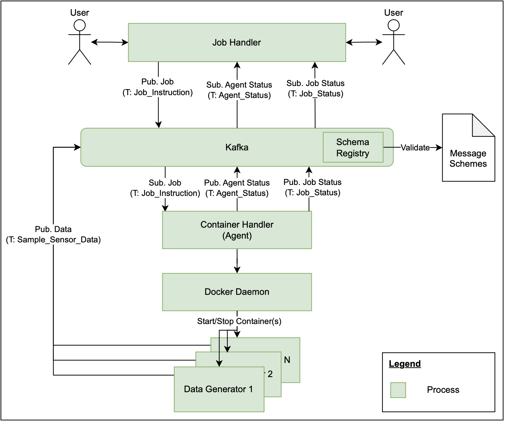

# Distributed Data Generation (A Distributed Computation Framework Based on Kafka and Docker)

## 1) Project Description and Provided Features
The goal of this project is to provide a distributed computation framework designed to manage the lifecycle of Docker containers that generate sample data and deliver it via distinct Kafka topics in the form of jobs.

With the help of a graphical user interface (GUI), users can easily submit jobs by providing only a small set of parameters, such as the Docker container image name and the Kafka topic where the generated data will be delivered (abstraction of complexity, without worrying about the underlying infrastructure). This simple interface is designed to be user-friendly and minimize the overhead for users to get started with data generation tasks.

Once a job is submitted, the framework orchestrates the necessary processes, ensuring that the user's requirements are met efficiently. The framework is designed to scale, allowing it to handle multiple concurrent jobs, each with unique parameters. 

## 2) Framework Architecture
### 2.1) Architecture & Components
The proposed framework consists of six main components, which are described briefly subsequently:

1) **Kafka**: Distributed event streaming platform used to a) coordinate actions performed by the Job Handler and Container Handler (Agent), to b) provide agent monitoring mechanisms, and c) provide an event streaming endpoint for the data generator(s). While the topics for a) and b) are predefined and use schema validation, the topic(s) for c) can be defined individually for each submitted job and schema validation is not performed.

    The distributed computation framework uses Apache Kafka Raft (KRaft) as a consensus protocol, allowing the removal of Apache ZooKeper and its dependencies. The result is a simplified architecture, as the responsibility for metadata management can be consolidated into Kafka itself.

   To allow the framework to orchestrate the necessary processes, the three management topics 1) Job_Handling (creation & deletion of jobs), 2) Job_Status (status information of the jobs submitted) and 3) Agent_Status (status information of the Container Handler (Agent)) are used. With a replication factor of 1 and only 1 partition, they all share the same configuration. More about the limitations of this configuration can be found in [section 5](#5-limitations--outlook).

2) **Kafka Schema Registry**: Repository (centralized) for management and validation of schemes for message data that supports serialization and deserialization. The schema registry takes on a key role en ensuring data consistency and compatibility, especially as schemes evolve.

    The distributed computation framework uses Apache Avro as the serialization format. The three different Avro schemes 1) [Job Handling](./schemes/job_handling.avsc), 2) [Job Status](./schemes/job_status.avsc) and 3) [Agent Status](./schemes/agent_status.avsc) are defined and go hand in hand with the topics described above.

3) **Docker Daemon**: Service responsible for orchestrating container lifecycle management. It handles tasks such as container creation, execution, deletion and monitoring required to fulfil the jobs submitted.

4) **Job Handler**: @Leandro, GUI + Business Logic
As the Job Handler (Agent) plays a crucial role within the framework, it will be described in more detail in [section 2.2](#22-job-handler).

5) **Container Handler (Agent)**: Agent, which is responsible for starting/stopping containers and providing a monitoring capabilities for processing jobs submitted via the GUI. As the Container Handler (Agent) plays a crucial role within the framework, it will be described in more detail in [section 2.3](#23-container-handler-agent).

6) **Data Generator(s)**: Docker containers that generate and expose sample data to a chosen/defined Kafka topic. As the logic for generating data is out of scope, the focus is on configuring the data generator containers to fit into the distributed computation framework. For this, [section 3.4](#34-preparation-of-docker-containers) can be consulted.


The graphical representation of the distributed computation framework architecture and the interactions between the six different components can be found in the Figure 01 below:

*Figure 01: Architecture Overview*

### 2.2) Job Handler
@Leandro

The graphical representation of the Job Handler architecture and the interactions necessary can be found in the Figure 02 below:

*Figure 02: Architecture Overview Job Handler*

### 2.3) Container Handler (Agent)
In order for the Container Handler (Agent) to be able to start/stop containers and provide monitoring capabilities, several components are required - of particular interest is the Container Handler (Agent) process, which consists of the following two threads (multithreaded environment):
- Agent Monitor: Responsible for monitoring the health of the Docker daemon and reporting on the containers under the responsibility of the specific agent. The Agent Monitor provides the monitoring result to the Job Handler via the Kafka topic Agent_Status at a predefined interval. If access to the Docker daemon fails, not only is an unsuccessful monitoring result sent, but the container handler (thread) is also blocked, meaning that no further messages are consumed.
- Container Handler: Responsible for starting/stopping containers by consuming messages from the Job_Instruction Kafka topic and communicating with the Docker Daemon. After each and every job is processed, a status message targeting the specific processed job is created in the Job_Status Kafka topic. Sophisticated exception handling ensures that the Container Handler runs as reliably as possible.

The graphical representation of the Container Handler (Agent) architecture and the interactions necessary can be found in the Figure 03 below:

*Figure 03: Architecture Overview Container Handler (Agent)*

### 2.4) Technologies used

To implement the distributed computation framework, the following technology stack is used:


## 3) Getting Started
### 3.1) Prerequisites
- Python in v3.13 https://www.python.org/downloads/release/python-3130
- Running Docker Daemon on all host machines on which the Container Handler (Agent) is to run (https://docs.docker.com/engine/install)
- (Optional, but highly recommended) A Python virtual environment (venv). To do so, proceed as follows:
    1. Navigate to the root directory
    2. Create the Python virtual environment named venv:
        ```bash
        python3.13 -m venv venv
        ```
    3. Activate the virtual environment and make sure it has been activated correctly :
        ```bash
        source venv/bin/activate
        which python3.13 && which pip3.13
        # Ensure, the following ouput is returned to check for correct activation:
        # ./venv/bin/python3.13
        # ./venv/bin/pip3.13
        ```
- Dependencies which can be installed as follows:
    1. Navigate to the root directory
    2. Install the required dependencies:
        ```bash
        python3.13 -m pip install -r requirements.txt
        ```
### 3.2) Kafka
With the provided [Docker Compose File](./kafka/docker-compose.yaml), the installation of Kafka is straightforward. As additional configuration is performed automatically during startup (see [initialize.py](./kafka/initialize.py) and initializer container within Docker Compose File), only the subsequent steps must be completed:
1. Navigate to the root directory
2. Start Kafka, the GUI and the Schema registry by running the following command:
   ```bash
    docker compose -f kafka/docker-compose.yaml up -d
    # be aware: Kafka might take a few seconds to be deployed

    # if it should be necessary to stop the cluster, use docker compose -f kafka/docker-compose.yaml down
    ```
3. Set the following environment variable and (optional) check if they were set correctly by running the following command:
    ```bash
    export KAFKA_BOOTSTRAP_SERVERS=localhost:9092 && export SCHEMA_REGISTRY_URL=http://localhost:8081

    # by running
    ENV | grep -e "KAFKA_BOOTSTRAP_SERVER" -e "SCHEMA_REGISTRY_URL"
    # Ensure, the following output is returned:
    # KAFKA_BOOTSTRAP_SERVERS=localhost:9092
    # SCHEMA_REGISTRY_URL=http://localhost:8081
    ```
4. (Optional) After the startup of Kafka, you can access:<br>
    4.1 Kafka Grapical User Interface: http://localhost:8080<br>
    4.2 Kafka Schema registry: http://localhost:8081


### 3.2) Job Handler
@Leandro

### 3.3) Container Handler (Agent)
To start up an instance of the Container Handler (Agent), proceed as follows:
1. Navigate to the root directory
3. Start the Container Handler (Agent) by performing the subsequent command and (optional) check the
[log file](./logs/app.log):
    ```bash
    python3.13 -m orchestrator.container_handler.container_handler
    ```


### 3.4) Preparation of Docker Containers
- hier beschreiben, wie man die docker container vorbereiten muss dass alles sauber läuft

## 4) Usage
### 4.1) Subtitle
@Lendro & @Christian, as soon as Graphical User Interface is ready


## 5) Limitations & Outlook
- hier sagen dass man alles noch paketieren könnte, vor allem agent und so, damit man alles schöner laufen lassen kann und auch nutzen kann
- evtl noch differenzierteres exception handling, etc. 

- sagen, dass man den agent containerisieren muss, auch wegen dependencies, etc. 

architecture

getting started
prerequisited
run locally, usage, further improvements 
-> aufteilen in kafka, frontend und generator, agents

erwähnen dass wir 1,1 haben, und die limitationen aufzeigen


erwähnen dass eine limitation ist, dass wir nur von dockerhub ziehen


erwähnen dass wir 1,1 haben, und die limitationen aufzeigen


erwähnen dass eine limitation ist, dass wir nur von dockerhub ziehen

erwàhnen, dass man den agent monitor noch um zusàtzliche checks erweitern kann/muss

erwähnen, dass man den agent containerisieren muss und dann an mehreren orten laufen lassen kann, aber natürlich nur wenn topics sauber configuriert sind

## 6) licensing
The distributed computation framework is available under the MIT [license](./LICENSE)

## 7) contacts
- **Christian Bieri**, Site Reliability Engineer, info@christianbieri.ch
- **Frederico Fischer**, Frontend Engineer, fredae14@hotmail.com
- **Leandro Hoehnen**, DevOps Engineer, exponent_stooge805@perfunc.ch